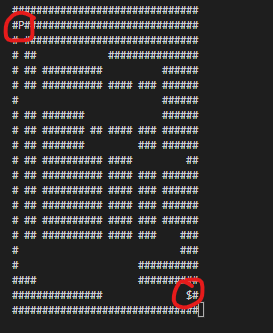
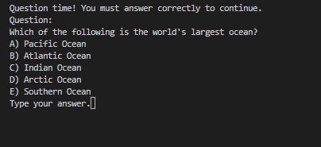

# Maze game with AI educational questions

## Use arrow keys to get to the $ sign and win!



## Answer questions randomly to learn and continue to play



## SETUP

```bash
pip install git+https://github.com/garland3/maze_terminal_game
```

* CLI game for playing a maze game.
* Add your openai api key to src/mazegame/.secrets.toml as

```toml
OPENAI_API_KEY="blahblahblah"
````

or use the environment variable `DYNACONF_OPENAI_API_KEY`

## settings

 You can configure the /src/mazegame/settings.toml file to change the maze parameters.

```toml
question_probability = 0.1
moves_before_new_question_can_be_asked = 7
grade_level = "5th"
question_topic = "geography"
```
